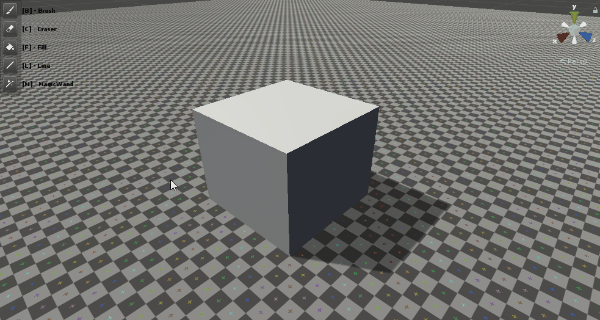
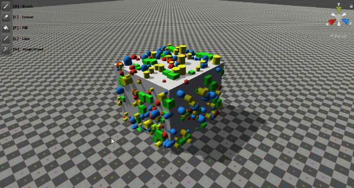

Prefabshop
==============

**Prefabshop** is an customizable tool which allows you to place Prefabs on colliders surfaces in the scene view. 
Project plan https://trello.com/b/BXGkQKmK/prefabshop

System Requirements
-------------------

- Unity 2019.1 or later

Installation
--------------
- Create folder in your project eg `Assets/Packages/Prefabshop`
- Open created folder in GitBush or over Version Control System
- If your project is repository, then add this rep like submodule
    - `git submodule add https://github.com/Raptorij/Prefabshop.git Assets/Packages/Prefabshop/`
- If you project is no repository, then just use:
    - `git init`
    - `git remote add origin https://github.com/Raptorij/Prefabshop.git`
    - `git pull origin master`

How To Use
--------------
- Open Prefabshop window in `Tools/Prefabshop`
- Load BrushInfo asset which includes list of prefabs
- Select tool with hotkey or button in top left corner of the SceneView
- Set up tool parameters in opened Parameters window
- Use tool...

Tools
-------------------

Tools  | Description | Usage Example
----------------|----------------------|----------------------
_**Brush**_ - [B]      | BrushTool allows you to place Prefabs. In settings of this tool you can add black-white texture to place objects inside some shape, there are examples of such textures in the project.   | 
_**Eraser**_ - [C]     | EraserTool allow you to Remove Prefabs | 
_**Line**_ - [L]       | LineTool allows you to place Prefabs by line | 
_**Fill**_ - [G]       | FillTool allows you to randomly place Prefabs on object surface | 
_**Magic Wand**_ - [M]  | LineTool allows you to select all prefabs instance on scene by select one of them | 
_**Lasso**_ - [P] (Demo) | LassoTool allows you to create mask for painting | 