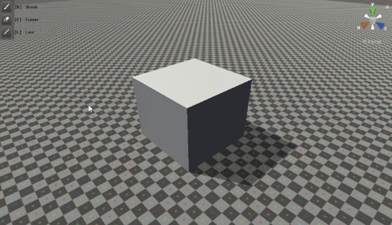
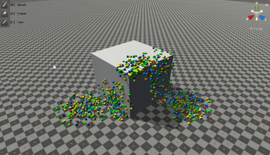
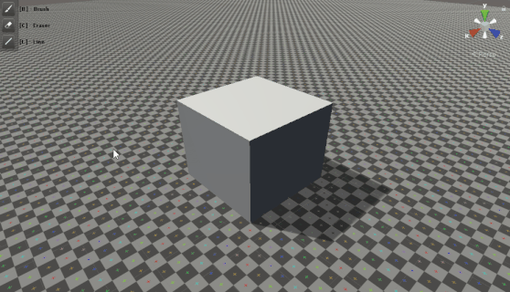

Prefabshop
==============

**Prefabshop** is an customizable tool which allows you to place Prefabs on colliders surfaces in the scene view. 
Project plan https://trello.com/b/BXGkQKmK/prefabshop

System Requirements
-------------------

- Unity 2019.1 or later

Tools
-------------------

**Brush**
    `BrushTool allows you to place Prefabs`

**Eraser**
    `EraserTool allow you to Remove Prefabs`

**Line**
    `LineTool allows you to place Prefabs by line`
